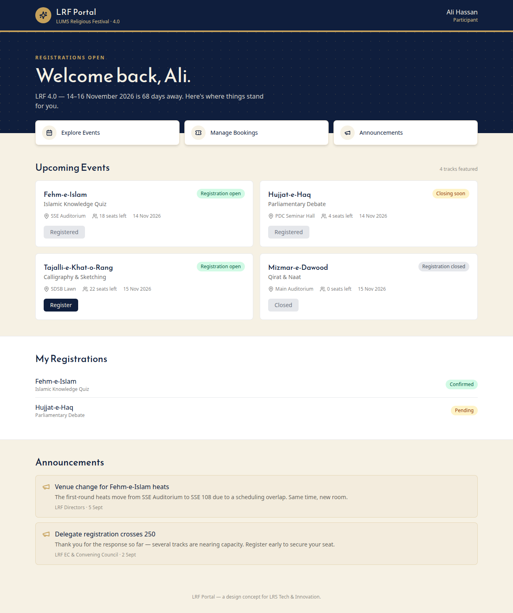
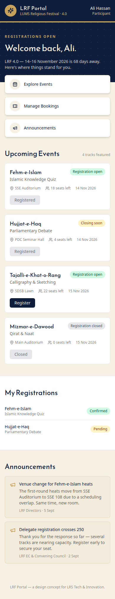

# LRF Participant Landing Page

A design-and-build submission for the **LRS Tech & Innovation Department** general-body application task (Part 2B).

This is **one screen** of a hypothetical full-stack LRF portal: the page a **Participant** sees immediately after logging in. It is not the full application — there is no real backend, authentication, or database. All data comes from a mock module (`src/data/mockData.js`) shaped to match the entities described in the accompanying system-design write-up (Part 2A).

## What's on the screen
- **Header** — LRF branding and the signed-in participant's identity.
- **Status hero** — a personalized greeting and where the festival stands right now (countdown, registration status).
- **Shortcuts** — quick jumps to Events, My Bookings, and Announcements.
- **Upcoming events** — festival tracks with venue, date, seats remaining, and a working (client-side only) "Register" action.
- **My registrations** — the participant's own bookings and their status.
- **Announcements** — updates published by Directors / EC & Convening Council.

## Design language
Navy (`#0F1E3D`), cream (`#F6F1E4`), and gold (`#C6A15B`) — sourced from [lrs.lums.edu.pk](https://lrs.lums.edu.pk/) — paired with a geometric display font (`Reem Kufi`, self-hosted, OFL-licensed) for headings, to keep the participant's first screen visually continuous with LRF's existing identity while feeling like a personal dashboard rather than a marketing page.

## Stack
React 18 + Vite + Tailwind CSS, `lucide-react` for icons, `@fontsource/reem-kufi` for the self-hosted display font (no runtime calls to any font/icon CDN).

## Screenshots
Desktop and mobile captures are in [`UI/`](UI/):

| Desktop | Mobile |
|---|---|
|  |  |

## Running it locally
```bash
npm install
npm run dev
```
Then open the printed local URL (typically `http://localhost:5173`).

To produce a static build:
```bash
npm run build
npm run preview
```

## Project structure
```
src/
├── App.jsx              # composes the page from mock data
├── data/mockData.js     # Participant / Event / Registration / Announcement mocks
└── components/
    ├── Header.jsx
    ├── StatusHero.jsx
    ├── NavShortcuts.jsx
    ├── EventList.jsx
    ├── MyRegistrations.jsx
    └── Announcements.jsx
```

## Related write-ups
The full "what is LRF", system-thinking (Part 2A), and design-concept (Part 2B) answers submitted alongside this repo are in the application form itself; the conceptual system architecture they're based on is also captured in this repo's design notes for traceability.
